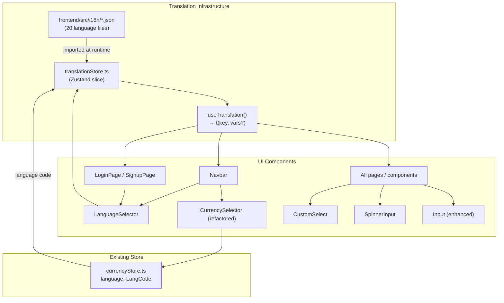

# Design Document

## Multi-Language Internationalization

---

## Overview

This design adds a complete i18n layer to ShopHub. The application already stores a `language` code in `currencyStore.ts` and applies RTL direction to the document, but no translation layer exists — all UI text is hardcoded in English. This feature wires up the missing translation engine, splits the combined Currency+Language selector into two independent controls, surfaces a language picker on the auth pages, and replaces three browser-native UI elements (number spinner, sort dropdown, validation marks) with modern custom components.

The approach is deliberately lightweight: no external i18n library is introduced. Instead, a thin translation store built on top of the existing Zustand `currencyStore` loads static JSON files per language and exposes a `t()` function. This keeps the bundle small, avoids a new dependency, and integrates cleanly with the existing persistence slice.

**Key design decisions:**

- **No new i18n library.** `react-i18next` / `i18next` would add ~30 KB and require a separate provider. A hand-rolled store using Zustand + JSON files achieves the same result with zero extra dependencies.
- **Extend `currencyStore`, don't duplicate it.** The language code already lives in `currencyStore`. The translation store reads from the same Zustand slice rather than creating a second `localStorage` key.
- **Static JSON files, not dynamic API.** Translation files are bundled with the frontend. This avoids a network round-trip on every language switch and works offline.
- **CSS logical properties for RTL.** Tailwind's `ps-`/`pe-` utilities (padding-inline-start/end) are used wherever possible so LTR and RTL layouts share the same class names.

---

## Architecture



**Data flow for a language switch:**

1. User clicks a language in `LanguageSelector`.
2. `setLanguage(code)` is called on `currencyStore` (existing action).
3. `currencyStore.setLanguage` sets `document.documentElement.dir` / `.lang` and persists to `localStorage`.
4. `translationStore` subscribes to `currencyStore.language`; on change it loads the corresponding JSON module and updates the `translations` map.
5. All components using `useTranslation()` re-render because the `t` function reference changes.

---

## Components and Interfaces

### 1. Translation Store (`frontend/src/store/translationStore.ts`)

```typescript
interface TranslationState {
  translations: Record<string, string>;  // flat key → value map for active language
  enTranslations: Record<string, string>; // English fallback, always loaded
  isLoading: boolean;

  loadLanguage: (code: LangCode) => Promise<void>;
  t: (key: string, vars?: Record<string, string>) => string;
}
```

- Implemented as a Zustand store (no `persist` middleware — language code persistence is already handled by `currencyStore`).
- `loadLanguage` dynamically imports `../i18n/{code}.json` using Vite's `import()`. The English file is always loaded as a fallback.
- `t(key, vars)` looks up `translations[key]`, falls back to `enTranslations[key]`, then falls back to `key` itself. Interpolation replaces `{{varName}}` tokens with `vars[varName]`.
- The store subscribes to `useCurrencyStore` via `useCurrencyStore.subscribe` so it reacts to language changes without requiring a React component.

### 2. `useTranslation` Hook (`frontend/src/hooks/useTranslation.ts`)

```typescript
export function useTranslation() {
  const t = useTranslationStore((s) => s.t);
  return { t };
}
```

A thin wrapper that extracts `t` from the store. Components import this hook and call `t('some.key')`.

### 3. `LanguageSelector` Component (`frontend/src/components/ui/LanguageSelector.tsx`)

Extracted from the existing `CurrencySelector` component. Renders:
- A trigger button showing the active language's flag + code (e.g. `🇺🇸 EN`).
- A dropdown panel with a search input and a scrollable list of all 20 languages.
- Each row: flag, native name, English name, optional RTL badge.
- Closes on outside click or Escape key.
- Accepts an optional `compact` prop for the auth-page variant (no code label, just flag + chevron).

```typescript
interface LanguageSelectorProps {
  compact?: boolean;  // auth page variant — smaller trigger
  className?: string;
}
```

### 4. `CurrencySelector` (refactored, `frontend/src/components/ui/CurrencySelector.tsx`)

The existing component is simplified: the Language tab is removed. It now shows only the currency list. The trigger label becomes `🇮🇳 INR` (flag + code only, no language flag).

### 5. `CustomSelect` Component (`frontend/src/components/ui/CustomSelect.tsx`)

Replaces the native `<select>` in `ProductsPage` (sort dropdown) and any other location using a native select.

```typescript
interface SelectOption {
  value: string;
  label: string;
}

interface CustomSelectProps {
  options: SelectOption[];
  value: string;
  onChange: (value: string) => void;
  placeholder?: string;
  icon?: React.ReactNode;
  className?: string;
}
```

- Renders a styled trigger button (rounded-xl, matching existing border style).
- Opens a dropdown panel with styled option rows.
- Active option highlighted with `bg-orange-50 text-orange-600` (dark: `bg-orange-500/10 text-orange-400`).
- Keyboard navigation: ArrowUp/ArrowDown to move focus, Enter to select, Escape to close.
- Closes on outside click.
- `appearance-none` on the underlying element; no native select rendered.

### 6. `SpinnerInput` Component (`frontend/src/components/ui/SpinnerInput.tsx`)

Replaces `<input type="number">` in `PriceRangeFilter` (ProductsPage sidebar).

```typescript
interface SpinnerInputProps {
  value: string;
  onChange: (value: string) => void;
  onBlur?: () => void;
  min?: number;
  max?: number;
  step?: number;
  placeholder?: string;
  prefix?: string;  // currency symbol
  className?: string;
}
```

- Renders `[−] [input] [+]` layout.
- `−` button: decrements by `step` (default 1), clamped to `min` (default 0).
- `+` button: increments by `step`.
- Input field: `type="text"` with `inputMode="numeric"` and `pattern="[0-9]*"` to suppress browser spinner arrows without CSS hacks. Alternatively uses `type="number"` with `[&::-webkit-inner-spin-button]:appearance-none` Tailwind arbitrary variant.
- Matches `Input.tsx` border/focus-ring styles.
- Dark mode support via Tailwind dark classes.

### 7. `Input` Component (enhanced, `frontend/src/components/ui/Input.tsx`)

The existing component already applies `border-red-400` on error. Enhancements:
- Add `role="alert"` and `aria-live="polite"` to the error `<p>` element.
- Add a small `AlertCircle` icon (Lucide) before the error text.
- Add a CSS entry animation (`animate-in slide-in-from-top-1 fade-in duration-150`) to the error message.
- Suppress browser-native `:invalid` styling with `[&:invalid]:shadow-none` on the input.

---

## Data Models

### Translation File Schema

Each file at `frontend/src/i18n/{langCode}.json` is a flat JSON object with dot-notation string keys:

```json
{
  "nav.search": "Search products...",
  "nav.cart": "Cart",
  "nav.wishlist": "Wishlist",
  "nav.login": "Login",
  "nav.signup": "Sign Up",
  "nav.logout": "Logout",
  "nav.dashboard": "Dashboard",
  "nav.profile": "My Profile",
  "nav.orders": "My Orders",
  "nav.wallet": "Wallet & Rewards",
  "nav.allProducts": "All Products",
  "nav.categories": "Categories",
  "nav.sellOnShopHub": "Sell on ShopHub",

  "auth.login.title": "Welcome back",
  "auth.login.subtitle": "Sign in to your account",
  "auth.login.email": "Email",
  "auth.login.password": "Password",
  "auth.login.forgotPassword": "Forgot password?",
  "auth.login.submit": "Sign In",
  "auth.login.noAccount": "Don't have an account?",
  "auth.login.signUp": "Sign up",
  "auth.login.orDivider": "OR",

  "auth.signup.title": "Get started",
  "auth.signup.subtitle": "Create your account",
  "auth.signup.username": "Username",
  "auth.signup.email": "Email",
  "auth.signup.phone": "Phone (optional)",
  "auth.signup.password": "Password",
  "auth.signup.confirmPassword": "Confirm Password",
  "auth.signup.submit": "Create Account",
  "auth.signup.hasAccount": "Already have an account?",
  "auth.signup.signIn": "Sign in",
  "auth.signup.roleCustomer": "🛒 Customer",
  "auth.signup.roleSeller": "🏪 Seller",

  "auth.validation.usernameRequired": "Username is required",
  "auth.validation.emailRequired": "Email is required",
  "auth.validation.passwordRequired": "Password is required",
  "auth.validation.passwordMinLength": "Password must be at least 6 characters",
  "auth.validation.passwordMismatch": "Passwords do not match",

  "auth.toast.loginSuccess": "Welcome back, {{name}}!",
  "auth.toast.loginFailed": "Login failed",
  "auth.toast.signupSuccess": "Account created! Please check your email to verify.",
  "auth.toast.signupFailed": "Signup failed",
  "auth.toast.logoutSuccess": "Logged out successfully",

  "products.title": "All Products",
  "products.resultsFor": "Results for",
  "products.found": "{{count}} product found",
  "products.foundPlural": "{{count}} products found",
  "products.sort.newestFirst": "Newest First",
  "products.sort.priceLowHigh": "Price: Low → High",
  "products.sort.priceHighLow": "Price: High → Low",
  "products.filter.categories": "Categories",
  "products.filter.allCategories": "All Categories",
  "products.filter.priceRange": "Price Range",
  "products.filter.inStockOnly": "In Stock Only",
  "products.filter.clearFilters": "Clear {{count}} filter",
  "products.filter.clearFiltersPlural": "Clear {{count}} filters",
  "products.filter.clearAll": "Clear all",
  "products.filter.clearSearch": "Clear search",
  "products.filter.clearPriceFilter": "Clear price filter",
  "products.filter.searchCategories": "Search categories…",
  "products.filter.noCategoriesFound": "No categories found",
  "products.filter.filters": "Filters:",
  "products.filter.inStock": "In Stock",
  "products.search.placeholder": "Search…",
  "products.empty.title": "No results for",
  "products.empty.noFilters": "your filters",
  "products.empty.subtitle": "Try different keywords or browse our suggestions below",
  "products.empty.youMightLike": "You Might Like",
  "products.instantResults": "Instant Results",
  "products.seeAllResults": "See all results for",

  "common.loading": "Loading...",
  "common.search": "Search",
  "common.cancel": "Cancel",
  "common.save": "Save",
  "common.delete": "Delete",
  "common.edit": "Edit",
  "common.close": "Close",
  "common.confirm": "Confirm",
  "common.back": "Back",
  "common.next": "Next",
  "common.submit": "Submit",
  "common.add": "Add",
  "common.remove": "Remove",
  "common.update": "Update",
  "common.view": "View",
  "common.noResults": "No results found",

  "currency.selectCurrency": "Select currency or language",
  "currency.searchCurrency": "Search currency…",
  "currency.searchLanguage": "Search language…",
  "currency.noCurrenciesFound": "No currencies found",
  "currency.noLanguagesFound": "No languages found",

  "cart.title": "Shopping Cart",
  "cart.empty": "Your cart is empty",
  "cart.checkout": "Proceed to Checkout",
  "cart.total": "Total",
  "cart.subtotal": "Subtotal",
  "cart.remove": "Remove",
  "cart.quantity": "Quantity",

  "checkout.title": "Checkout",
  "checkout.placeOrder": "Place Order",
  "checkout.orderSummary": "Order Summary",
  "checkout.shippingAddress": "Shipping Address",
  "checkout.paymentMethod": "Payment Method",

  "orders.title": "My Orders",
  "orders.empty": "No orders yet",
  "orders.status.pending": "Pending",
  "orders.status.processing": "Processing",
  "orders.status.shipped": "Shipped",
  "orders.status.delivered": "Delivered",
  "orders.status.cancelled": "Cancelled",
  "orders.status.returned": "Returned",

  "wishlist.title": "My Wishlist",
  "wishlist.empty": "Your wishlist is empty",
  "wishlist.addToCart": "Add to Cart",
  "wishlist.remove": "Remove",

  "profile.title": "My Profile",
  "profile.save": "Save Changes",
  "profile.username": "Username",
  "profile.email": "Email",
  "profile.phone": "Phone",

  "seller.dashboard": "Dashboard",
  "seller.products": "Products",
  "seller.orders": "Orders",
  "seller.coupons": "Coupons",
  "seller.categories": "Categories",
  "seller.messages": "Messages",

  "admin.dashboard": "Dashboard",
  "admin.categories": "Categories",
  "admin.sellers": "Sellers",
  "admin.products": "Products",
  "admin.returns": "Returns",

  "errors.notFound": "Page not found",
  "errors.serverError": "Something went wrong",
  "errors.networkError": "Network error. Please try again.",
  "errors.unauthorized": "You are not authorized to view this page"
}
```

The full key set covers all pages in scope. The above is a representative excerpt; the actual `en.json` will be comprehensive. All 19 other language files contain the same keys with translated values.

### Navbar Layout (Separated Selectors)

```
[Logo] [Search Bar ──────────────────] [Cart] [Wishlist] [Theme] [LanguageSelector] [CurrencySelector] [User]
```

- `LanguageSelector` sits to the left of `CurrencySelector` in the right-actions group.
- On mobile, both selectors are visible in the collapsed header row (they are compact enough).

### Auth Page Layout (Language Selector)

```
┌─────────────────────────────────────────────────────┐
│                                    [🇺🇸 EN ▾]        │  ← absolute top-right
│                                                     │
│              [Logo]                                 │
│         [Login / Signup Card]                       │
└─────────────────────────────────────────────────────┘
```

The `LanguageSelector` is positioned `absolute top-4 right-4` relative to the page container.

---

## Correctness Properties

*A property is a characteristic or behavior that should hold true across all valid executions of a system — essentially, a formal statement about what the system should do. Properties serve as the bridge between human-readable specifications and machine-verifiable correctness guarantees.*

### Property 1: Translation File Key Completeness

*For any* non-English translation file in `frontend/src/i18n/`, the set of keys it contains SHALL equal the set of keys in `en.json` — no extra keys, no missing keys.

**Validates: Requirements 1.3, 1.4**

### Property 2: Translation Fallback

*For any* translation key that is present in `en.json` but absent from the active language's translation map, calling `t(key)` SHALL return the English value for that key rather than the key string itself or an empty string.

**Validates: Requirements 1.5**

### Property 3: Interpolation Substitution

*For any* translation value string containing one or more `{{varName}}` placeholders and any `vars` object whose keys include all placeholder names, calling `t(key, vars)` SHALL return a string where every `{{varName}}` token has been replaced by `vars[varName]`, with no unreplaced tokens remaining.

**Validates: Requirements 1.6**

### Property 4: JSON Round-Trip

*For any* valid translation file, parsing the JSON content, serialising the result back to JSON, and parsing again SHALL produce an object that deep-equals the original parsed object.

**Validates: Requirements 1.7**

### Property 5: RTL/LTR Direction Correctness

*For any* language code in the supported `LANGUAGES` array, calling `setLanguage(code)` SHALL set `document.documentElement.dir` to `"rtl"` if and only if that language's `rtl` field is `true`; otherwise it SHALL be set to `"ltr"`.

**Validates: Requirements 2.6, 2.7, 9.1, 9.5, 10.5**

### Property 6: Language Persistence Round-Trip

*For any* language code in the supported `LANGUAGES` array, calling `setLanguage(code)` SHALL result in the Zustand persistence slice writing that code to `localStorage` under the key `shophub-currency`, such that reading and parsing that key returns an object whose `language` field equals `code`.

**Validates: Requirements 2.3, 10.1, 10.4**

### Property 7: Language Switch Reactivity

*For any* two distinct language codes `A` and `B`, and *for any* translation key `k` whose value differs between the two languages, after calling `setLanguage(A)` the store's `t(k)` SHALL return the language-A value, and after calling `setLanguage(B)` the store's `t(k)` SHALL return the language-B value — without a page reload.

**Validates: Requirements 2.2, 3.4**

### Property 8: Spinner Arithmetic

*For any* numeric value `v ≥ 0` and step `s > 0`, the `SpinnerInput` increment operation SHALL produce `v + s`, and the decrement operation SHALL produce `max(0, v − s)`.

**Validates: Requirements 7.3, 7.4**

---

## Error Handling

### Missing Translation Key

If `t(key)` is called with a key that does not exist in either the active language file or the English fallback, the function returns the key string itself (e.g. `"nav.search"`). This makes missing keys visible during development without crashing the app.

### Failed JSON Import

If a language's JSON file fails to load (network error in a CDN-served build, or a corrupt file), `loadLanguage` catches the error, logs a warning to the console, and leaves `translations` pointing at the previously loaded language's data. The UI continues to function in the last-known language.

### Invalid Language Code

If `setLanguage` is called with a code not in `LANGUAGES`, the store ignores the call and logs a warning. This prevents a broken state from an unexpected `localStorage` value.

### Interpolation with Missing Variable

If `t(key, vars)` is called and a `{{varName}}` placeholder has no corresponding entry in `vars`, the placeholder is left as-is in the output string (e.g. `"Welcome, {{name}}!"`). This is intentional — it makes the bug visible rather than silently producing an empty string.

### SpinnerInput Boundary

If the user types a non-numeric value directly into the `SpinnerInput` field, the `onChange` handler receives the raw string. The parent component (`PriceRangeFilter`) already handles empty/invalid strings by treating them as "no filter". The `−` button is disabled when `value === '' || Number(value) <= 0`.

### CustomSelect Keyboard Navigation

If the dropdown is open and the user tabs away, the panel closes (via `onBlur` on the container). This prevents the dropdown from remaining open when focus moves to another element.

---

## Testing Strategy

### Unit Tests (Vitest)

Focus on pure logic that is fast and deterministic:

- `translationStore.t()`: key lookup, fallback to English, interpolation substitution, missing-key passthrough.
- `translationStore.loadLanguage()`: correct JSON is loaded, fallback on error.
- `SpinnerInput` arithmetic: increment/decrement with various values and steps.
- `CustomSelect`: option selection, keyboard navigation state machine.
- `Input` error state: correct class application, `role="alert"` presence.

### Property-Based Tests (fast-check, Vitest)

fast-check is the standard PBT library for TypeScript/JavaScript. Each property test runs a minimum of 100 iterations.

**Setup:** `npm install --save-dev fast-check` in the `frontend` directory.

**Property 1 — Key Completeness:**
```typescript
// Feature: multi-language-internationalization, Property 1: Translation file key completeness
// For each non-English language file, its key set equals en.json's key set
it.each(NON_EN_LANG_CODES)('key set of %s equals en.json', (code) => {
  const enKeys = new Set(Object.keys(enTranslations));
  const langKeys = new Set(Object.keys(translations[code]));
  expect(langKeys).toEqual(enKeys);
});
```
*(This is a parameterised example test rather than a generative PBT, since the input space is the fixed set of 19 files.)*

**Property 2 — Fallback:**
```typescript
// Feature: multi-language-internationalization, Property 2: Translation fallback
fc.assert(fc.property(
  fc.constantFrom(...Object.keys(enTranslations)),
  fc.constantFrom(...NON_EN_LANG_CODES),
  (key, langCode) => {
    const partialTranslations = { ...translations[langCode] };
    delete partialTranslations[key];
    const result = tWithTranslations(partialTranslations, enTranslations, key);
    return result === enTranslations[key];
  }
), { numRuns: 100 });
```

**Property 3 — Interpolation:**
```typescript
// Feature: multi-language-internationalization, Property 3: Interpolation substitution
fc.assert(fc.property(
  fc.array(fc.string({ minLength: 1, maxLength: 10 }).filter(s => /^[a-z]+$/.test(s)), { minLength: 1, maxLength: 5 }),
  fc.array(fc.string({ minLength: 1, maxLength: 20 }), { minLength: 1, maxLength: 5 }),
  (varNames, varValues) => {
    const uniqueNames = [...new Set(varNames)];
    const template = uniqueNames.map(n => `{{${n}}}`).join(' ');
    const vars = Object.fromEntries(uniqueNames.map((n, i) => [n, varValues[i] ?? 'x']));
    const result = interpolate(template, vars);
    return uniqueNames.every(n => !result.includes(`{{${n}}}`));
  }
), { numRuns: 200 });
```

**Property 4 — JSON Round-Trip:**
```typescript
// Feature: multi-language-internationalization, Property 4: JSON round-trip
fc.assert(fc.property(
  fc.dictionary(fc.string(), fc.string()),
  (obj) => {
    const roundTripped = JSON.parse(JSON.stringify(obj));
    expect(roundTripped).toEqual(obj);
    return true;
  }
), { numRuns: 100 });
```

**Property 5 — RTL/LTR Direction:**
```typescript
// Feature: multi-language-internationalization, Property 5: RTL/LTR direction correctness
fc.assert(fc.property(
  fc.constantFrom(...LANGUAGES),
  (lang) => {
    setLanguage(lang.code);
    const expectedDir = lang.rtl ? 'rtl' : 'ltr';
    return document.documentElement.dir === expectedDir;
  }
), { numRuns: 100 });
```

**Property 6 — Persistence Round-Trip:**
```typescript
// Feature: multi-language-internationalization, Property 6: Language persistence round-trip
fc.assert(fc.property(
  fc.constantFrom(...LANGUAGES.map(l => l.code)),
  (code) => {
    setLanguage(code);
    const stored = JSON.parse(localStorage.getItem('shophub-currency') ?? '{}');
    return stored.state?.language === code;
  }
), { numRuns: 100 });
```

**Property 7 — Language Switch Reactivity:**
```typescript
// Feature: multi-language-internationalization, Property 7: Language switch reactivity
fc.assert(fc.property(
  fc.constantFrom(...Object.keys(enTranslations)),
  (key) => {
    setLanguage('en');
    const enValue = t(key);
    setLanguage('fr');
    const frValue = t(key);
    // Both should be non-empty strings; if they differ, the switch worked
    return typeof enValue === 'string' && enValue.length > 0
        && typeof frValue === 'string' && frValue.length > 0;
  }
), { numRuns: 100 });
```

**Property 8 — Spinner Arithmetic:**
```typescript
// Feature: multi-language-internationalization, Property 8: Spinner arithmetic
fc.assert(fc.property(
  fc.float({ min: 0, max: 10000, noNaN: true }),
  fc.float({ min: 1, max: 100, noNaN: true }),
  (value, step) => {
    expect(increment(value, step)).toBeCloseTo(value + step, 5);
    expect(decrement(value, step)).toBeCloseTo(Math.max(0, value - step), 5);
    return true;
  }
), { numRuns: 200 });
```

### Integration Tests

- Language selector in Navbar: renders correct trigger label, opens panel, selects language, panel closes, page text updates.
- Language selector on auth pages: renders in top-right corner, persists selection.
- `CustomSelect` in `ProductsPage`: replaces native select, sort changes trigger product reload.
- `SpinnerInput` in `PriceRangeFilter`: `+`/`−` buttons update value, direct input works, `onChange` fires.
- RTL layout: selecting Arabic sets `dir="rtl"` on `<html>`.

### Snapshot Tests

- `LanguageSelector` rendered in default and compact modes.
- `CustomSelect` in open and closed states.
- `SpinnerInput` at min value (decrement button disabled).
- `Input` with and without error state.

### Manual / Visual Checks

- All 20 languages: verify translated text renders correctly (especially non-Latin scripts: Arabic, Hindi, Chinese, Japanese, Korean, Tamil, Telugu, Bengali, Thai).
- RTL layout: Arabic and Urdu — logo on right, sidebar on right, icon positions mirrored.
- Dark mode: all new components respect dark mode classes.
- WCAG 2.1 AA: keyboard navigation for `LanguageSelector`, `CustomSelect`; `role="alert"` on validation errors; focus-visible rings on all interactive elements.
